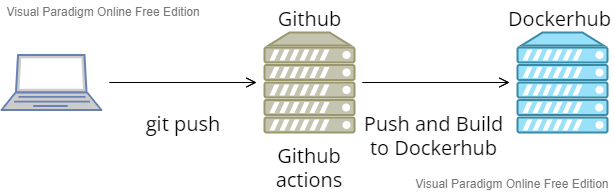
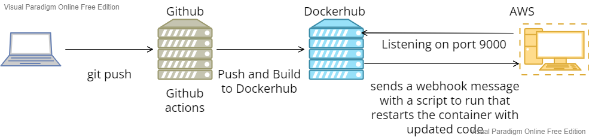

## Part 1
* to install docker i had to install using docker desktop because of problems with WSL2

* to build the container I did `docker build -t my-apache2 .`

* to run the container I ran the command `docker run -dit --name my-running-app -p 8080:80 my-apache2`

* you can view the website it creates at `http://localhost:8080/`

## Part 2
* You don't even need to create a docker repo manually, because the workflow will create one automatically

* username and password, put them in the repo's sercets setting page

* I named mine username and password section names to DOCKER_USERNAME and DOCKER_PASSWORD

* the only thing someone would have to change is the repo name it gets pushed to at the bottom of the yaml workflow, and make sure they set up their login info like I did

## Part 3
* used the aws.yaml file to build a ec2 instance
* `sudo apt install docker.io && sudo usermod -aG docker ubuntu`
* created through dockerhub

* The restart script kills the container, and runs the container from dockerhub

* the `hooks.json` file is feed into the webhooks application and listens for changes on a port and triggers something, in this case the restart script

* `webhook -hooks hooks.json --verbose`, the webhook is triggered by a github action that updates an action on dockerhub

* webhooks -> <name> <url> create (make sure the url is the port webhooks is listening on, and /hooks/{id} whatever your webhook id name is)

## Part 4

